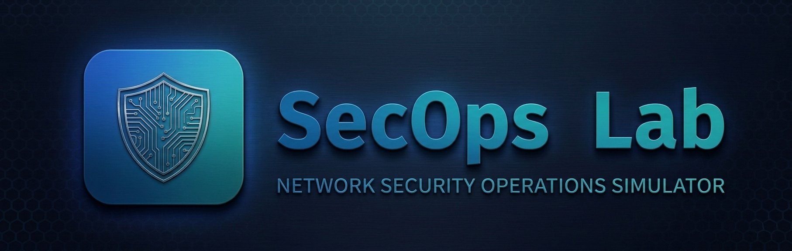
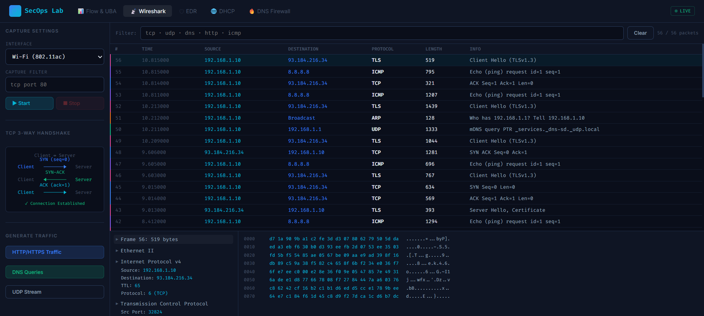

# 🛡️ SecOps Lab — Network Security Operations Simulator




<p align="center">
  
  
  
  
</p>

---

## 📋 Repository Info

### **About** 🛡️

**SecOps Lab** is a comprehensive, interactive network security operations simulator that brings together five critical security domains in one unified interface: Network Flow Analysis & UBA (User Behavior Analytics), Wireshark Packet Capture Simulation, EDR (Endpoint Detection & Response), DHCP Server Management, and DNS Firewall Configuration. Built with pure HTML/CSS/JavaScript, this educational tool allows security professionals, students, and IT administrators to practice real-world security operations in a safe, simulated environment — no actual network equipment required. 🔐


## ✨ Key Features

### 🎓 **5 Interactive Security Modules**

| Module                       | Focus              | Key Capabilities                                                                                               |
| ---------------------------- | ------------------ | -------------------------------------------------------------------------------------------------------------- |
| **01 — Flow & UBA**   | Network Monitoring | Real-time flow visualization, anomaly detection, user behavior analytics, DDoS simulation, threat correlation  |
| **02 — Wireshark**    | Packet Analysis    | Live packet capture simulation, TCP 3-way handshake, protocol filtering, hex dump viewer, packet dissection    |
| **03 — EDR**          | Endpoint Security  | Endpoint management, malware scanning, patch management, MFA setup, threat remediation                         |
| **04 — DHCP**         | Network Services   | IP address pool visualization, lease management, exclusion ranges, scope configuration, DHCP server simulation |
| **05 — DNS Firewall** | Network Security   | Windows Firewall outbound rules, DNS query testing, rule management, traffic flow visualization                |

---

## 📊 **Module 01: Flow & UBA — Network Flow Analysis & User Behavior Analytics**

### **Real-Time Network Monitoring** 📈

- **Live flow visualization** — animated network graph with real-time traffic spikes
- **Baseline threshold** — visual indicator for normal vs abnormal traffic
- **6 KPI metrics**: Flows/sec, Packets/sec, Anomalies, Alerts
- **Flow table** with 10+ data points per flow:
  - Time, Source IP, Destination IP, Protocol
  - Source/Destination Ports, Packets, Bytes
  - Duration, Flow Type, Status

### **Anomaly Detection** 🚨

- **Automated anomaly alerts** with severity indicators (CRITICAL/HIGH)
- **DDoS simulation** — SYN flood attack with multiple source IPs
- **Data exfiltration detection** — large outbound transfers to foreign IPs
- **Real-time alert feed** with timestamps and protocol details

### **User Behavior Analytics (UBA)** 👤

- **4 user profiles** with risk scoring (0-100)
- **Risk color coding**: 🔴 >70 (Critical), 🟡 40-70 (Warning), 🟢 <40 (Normal)
- **Anomaly detection** for off-hours access, IP mismatch
- **Breach simulation** — account compromise + data exfiltration scenario

### **Threat Detection Matrix** ⚠️

- **4 threat categories**: DDoS, Data Exfiltration, Insider Threat, Account Compromise
- **MITRE ATT&CK-aligned** indicators
- **Incident Correlation Engine** — links network flows with UBA signals
- **Automated response recommendations** (lock account, alert SOC, preserve logs)


---

## 📡 **Module 02: Wireshark — Packet Capture Simulation**

### **Live Packet Capture** 📦

- **Simulated interface selection** (Wi-Fi, Ethernet, Loopback)
- **Capture filter support** (tcp, udp, dns, http, icmp, arp, tls)
- **Start/Stop capture** with auto-generation every 600ms
- **Realistic packet timing** with microsecond precision

### **Packet Table** 📋

| Column                       | Description                         |
| ---------------------------- | ----------------------------------- |
| **#**                  | Packet sequence number              |
| **Time**               | Timestamp since capture start       |
| **Source/Destination** | IP addresses                        |
| **Protocol**           | TCP, UDP, DNS, HTTP, ICMP, ARP, TLS |
| **Length**             | Packet size in bytes                |
| **Info**               | Packet summary with flags/details   |

### **Protocol Support** 🎨

| Protocol       | Color  | Example                     |
| -------------- | ------ | --------------------------- |
| **TCP**  | Blue   | SYN, ACK, SYN-ACK handshake |
| **UDP**  | Green  | mDNS, DNS queries           |
| **DNS**  | Amber  | A record queries/responses  |
| **HTTP** | Cyan   | GET requests                |
| **ICMP** | Purple | Ping echo request/reply     |
| **TLS**  | Pink   | Client/Server Hello         |
| **ARP**  | Orange | MAC resolution              |

### **Packet Dissection** 🔍

- **Tree view** with expandable protocol layers:
  - Frame details
  - Ethernet II (MAC addresses)
  - Internet Protocol v4 (IP addresses, TTL)
  - TCP/UDP (ports, flags, sequence numbers)
  - Application layer (DNS queries, HTTP requests)
- **Hex dump** with byte-by-byte representation
- **ASCII translation** for payload inspection

### **TCP 3-Way Handshake Visualization** 🤝

- **Interactive diagram** showing SYN → SYN-ACK → ACK flow
- **Color-coded arrows** for each handshake step
- **Real-time status indicator** when connection established

### **Traffic Generation** ⚡

- **HTTP/HTTPS traffic** — simulate web browsing
- **DNS queries** — A, AAAA, MX, NS record lookups
- **UDP streams** — mDNS, other UDP traffic



---

## 🛡️ **Module 03: EDR — Endpoint Detection & Response**

### **Endpoint Management** 🖥️

- **5 endpoints** with detailed information:
  - Hostname, OS, IP address
  - Status (Protected / Threat Detected)
  - Risk scoring, patch count, last scan time
- **Threat detection** with red highlighting
- **Endpoint icons**: Windows, Ubuntu, macOS

### **EDR Dashboard** 📊

| Metric                | Count   |
| --------------------- | ------- |
| **Endpoints**   | 5       |
| **Protected**   | Dynamic |
| **Threats**     | Dynamic |
| **Patches Due** | 5       |

### **Patch Manager** 🔧

- **5 pending patches** with severity ratings:
  - 🔴 **Critical** — CVSS 9.0+
  - 🟠 **High** — CVSS 7.0-8.9
  - 🟡 **Medium** — CVSS 4.0-6.9
- **CVE identifiers** and release age
- **One-click install** with progress feedback
- **Batch install** for all critical patches

### **Malware Scanner** 🔍

- **Target endpoint selection**
- **Scan types**: Quick, Full System, Custom Path
- **Simulated scanning** with progress bar
- **Threat detection results**:
  - Trojan.GenericKD.68147
  - PUP.Optional.Bundler
- **Quarantine & remediation** actions
- **Scan statistics**: Files scanned, threats found, duration

### **MFA Setup** 🔐

- **QR code simulation** for authenticator app pairing
- **TOTP code verification** (6-digit demo)
- **Secret key display** (JBSWY3DPEHPK3PXP)


---

## 🌐 **Module 04: DHCP — Dynamic Host Configuration Protocol**

### **DHCP Server Manager** 🖧

- **IP address pool visualization** — 192.168.1.2–254
- **Color-coded cells** for address states:
  - 🟢 **Available** — Free IP addresses
  - 🔵 **Leased** — Currently assigned
  - 🔴 **Excluded** — Reserved for static IPs
  - 🟡 **Reserved** — MAC-based reservations
- **Hover tooltips** showing IP details and lease info

### **Scope Configuration** ⚙️

- **Scope name, range, subnet mask**
- **Lease duration** (default: 8 days)
- **Gateway (Option 3)** and DNS servers (Option 6)
- **Scope activation** with toast notification

### **Address Leases** 📋

- **Lease table** with:
  - Client IP, Hostname
  - MAC address
  - Expiration date
  - Lease type (Dynamic/Reserved)

### **Exclusion Ranges** 🚫

- **Define exclusion ranges** for static IP devices
- **6 printers excluded** (192.168.1.2–7)
- **Add/remove exclusions** dynamically
- **Real-time pool updates**

### **Scope Options** ⚙️

- **Option 003** — Router (Gateway): 192.168.1.1
- **Option 006** — DNS Servers: 8.8.8.8, 8.8.4.4
- **Option 015** — DNS Domain Name: corp.local

### **Address Reservations** 📌

- **MAC-based IP reservations** for:
  - Printers (static IPs)
  - Gateway (192.168.1.1)
- **New reservation creation** workflow

### **DHCP Server Installation Wizard** 🪄

- **7-step installation process**:
  1. Open Server Manager
  2. Add Roles and Features
  3. Select Installation Type
  4. Select Server
  5. Select DHCP Server Role
  6. Confirm and Install
  7. Completion
- **Auto-complete** function for quick lab completion


---

## 🔥 **Module 05: DNS Firewall — Windows Firewall Management**

### **Lab Wizard** 🪄

- **7-step guided tutorial** for creating Windows Firewall outbound rules:
  1. Open Windows Firewall
  2. Advanced Settings
  3. Outbound Rules
  4. New Rule Wizard
  5. Select Port Type (UDP 53)
  6. Set Action (Block)
  7. Name the Rule
- **Step tracking** with visual progress indicators
- **Interactive completion** with "Next Step" button

### **Outbound Rule Management** 📋

- **Create custom rules** with:
  - Rule type (Port/Program)
  - Protocol (TCP, UDP, Both)
  - Port number (default: 53)
  - Action (Allow/Block)
  - Custom rule name
- **Rule list** with:
  - Enabled/disabled status
  - Protocol and port details
  - Action badges (ALLOW/BLOCK)
  - Enable/disable toggles
  - Delete functionality

### **DNS Traffic Flow Visualization** 🌊

- **End-to-end flow diagram**:
  - Endpoint → Firewall → DNS (port 53) → Internet
- **Dynamic color coding**:
  - 🟢 **Green** — Traffic allowed
  - 🔴 **Red** — Traffic blocked
- **Real-time status text** reflecting current rules

### **DNS Query Testing** 🔬

- **Test any domain** (google.com, etc.)
- **DNS record type selection** (A, AAAA, MX, NS)
- **Query results** with:
  - ✅ **Resolved** — Returns simulated IP address
  - ❌ **Blocked** — Windows Firewall denies port 53 traffic
- **Live log** with timestamps and query results


---

## 🎨 **Design & Aesthetics**

### **Security Operations Center Aesthetic** 🖥️

- **Dark background** (`#0a0e1a`) — professional SOC environment
- **Red accent** (`#ef4444`) for critical alerts and threats
- **Cyan** (`#06b6d4`) for network flows and TCP
- **Green** (`#10b981`) for success and allowed traffic
- **Amber** (`#f59e0b`) for warnings and DNS
- **Blue** (`#3b82f6`) for protocols and endpoints

### **Typography** ✍️

- **Fira Code** — Monospace for tables, packet data, code
- **Inter** — Sans-serif for UI elements and labels

### **Visual Elements** 🖼️

- **Live indicator** — pulsing green dot
- **Toast notifications** — user feedback with color coding
- **Progress bars** — scan progress, patch installation
- **Color-coded badges** — severity indicators
- **Hover tooltips** — IP pool cells
- **Animated flow graph** — real-time network traffic visualization
- **Packet capture table** — scrolling with selection highlighting

---

## 🛠️ **Technical Implementation**

### **Tech Stack** 🥞

- **Pure HTML5/CSS3/JavaScript** — No frameworks or dependencies
- **Canvas API** — Real-time flow visualization
- **LocalStorage** — Not used (session-only simulation)

### **Core Components** 🧩

| Component               | Purpose                  | Features                           |
| ----------------------- | ------------------------ | ---------------------------------- |
| **Flow Canvas**   | Traffic visualization    | Animated graph, baseline threshold |
| **Packet Table**  | Wireshark simulation     | Filtering, selection, dissection   |
| **EDR Endpoints** | Endpoint management      | Status tracking, risk scoring      |
| **DHCP Pool**     | IP address visualization | Color-coded cells, hover tooltips  |
| **DNS Firewall**  | Rule management          | Create/edit/delete, enable/disable |

### **Key Functions** 🔧

```javascript
// Flow & UBA
addFRow()              // Add network flow record
simDDoS()              // Simulate DDoS attack
addAnomaly()           // Add anomaly alert
simBreach()            // Simulate account compromise
renderUBA()            // Render user behavior analytics
updateCorr()           // Update threat correlation

// Wireshark
startCap()             // Start packet capture
stopCap()              // Stop packet capture
applyFilter()          // Apply display filter
selPkt()               // Select packet for dissection
renderPktDetail()      // Render packet tree and hex dump
genHTTP()              // Generate HTTP/HTTPS traffic
genDNS()               // Generate DNS queries
genUDP()               // Generate UDP streams

// EDR
renderEDR()            // Render EDR dashboard
instPatch()            // Install security patch
runScan()              // Run malware scan
verifyMFA()            // Verify MFA code

// DHCP
renderDHCP()           // Render DHCP manager
addExcl()              // Add exclusion range
rmExcl()               // Remove exclusion
autoInstall()          // Auto-install DHCP server

// DNS Firewall
createRule()           // Create firewall rule
toggleRule()           // Enable/disable rule
delRule()              // Delete rule
updateFW()             // Update firewall visualization
testDNS()              // Test DNS query with rules
advWiz()               // Advance lab wizard
```

---

## 🎥 **Video Demo Script** (60-75 seconds)

| Time | Module       | Scene          | Action                                             |
| ---- | ------------ | -------------- | -------------------------------------------------- |
| 0:00 | Flow & UBA   | Canvas         | Show real-time flow spikes                         |
| 0:05 | Flow & UBA   | DDoS           | Click "Simulate DDoS" → 20 anomalous flows appear |
| 0:10 | Flow & UBA   | Alerts         | Alert feed shows "DDoS — SYN flood"               |
| 0:15 | Wireshark    | Capture        | Start capture → 3 packets auto-generate           |
| 0:20 | Wireshark    | TCP Handshake  | Show TCP 3-way handshake diagram                   |
| 0:25 | Wireshark    | Packet Details | Click SYN packet → Tree view expands              |
| 0:30 | EDR          | Endpoints      | Show 5 endpoints, 2 with threats                   |
| 0:35 | EDR          | Scan           | Run malware scan → Progress bar to 100%           |
| 0:40 | EDR          | Results        | 2 threats found → Quarantine                      |
| 0:45 | DHCP         | IP Pool        | Show color-coded IP cells (green/blue/red)         |
| 0:50 | DHCP         | Leases         | Show active leases table with hostnames            |
| 0:55 | DNS Firewall | Wizard         | Click through 7-step wizard                        |
| 1:00 | DNS Firewall | Create Rule    | Create block rule for port 53                      |
| 1:05 | DNS Firewall | Test           | Query google.com → BLOCKED response               |
| 1:10 | Toast        | Feedback       | Success message appears                            |

---

## 🚦 **Performance**

- **Load Time**: < 1 second (no external dependencies)
- **Memory Usage**: < 50 MB
- **Animation**: Canvas-based flow graph (60fps)
- **Real-time Updates**: Simulated packet generation (600ms intervals)

---

## 🛡️ **Security Notes**

SecOps Lab is a **completely safe** educational simulator:

- ✅ No actual network connections
- ✅ No real packet capture
- ✅ No system modifications
- ✅ All data simulated in-browser
- ✅ Pure HTML/CSS/JavaScript
- ✅ Educational purposes only — learn security operations safely

---

## 📝 **License**

MIT License — see LICENSE file for details.

---

## **🙏🏿 Acknowledgments**

- **Wireshark** — Packet dissection inspiration
- **Xcitium OpenEDR** — Endpoint detection and response concepts
- **Microsoft DHCP Server** — Scope and lease management
- **Windows Defender Firewall** — Outbound rule configuration
- **MITRE ATT&CK** — Threat framework alignment

---

## 📧 **Contact**

- **GitHub Issues**: [Create an issue](https://github.com/Willie-Conway/SecOps-Lab/issues)
- **Website**: https://willie-conway.github.io/SecOps-Lab/

---

## 🏁 **Future Enhancements**

- [ ] Add SIEM log correlation
- [ ] Include more attack types (Mimikatz, Pass-the-Hash)
- [ ] Add network topology visualization
- [ ] Implement real-time alert dashboards
- [ ] Add incident response playbooks
- [ ] Include compliance reporting (NIST, ISO)
- [ ] Add multi-user collaboration
- [ ] Export forensic evidence packages
- [ ] Add threat hunting queries
- [ ] Include SOAR automation examples


*Last updated: March 2026*